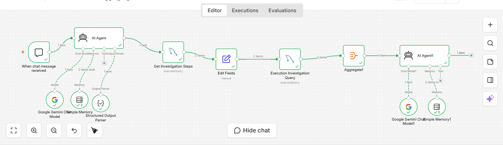

# 🤖 AI Production Debugging Agent

> A metadata-driven AI Production Support Agent built using **n8n, Google Gemini, and MySQL** that automates production issue investigation by combining AI reasoning, metadata-driven workflows, and dynamic SQL execution.

---

# 📌 Project Overview

Production Support Engineers often spend significant time understanding incidents, identifying the correct database tables, writing SQL queries, and performing Root Cause Analysis (RCA).

This project automates that investigation process using AI Agents, Metadata Repository, and Dynamic SQL Generation.

Instead of hardcoding SQL logic into AI prompts, the solution stores investigation knowledge in metadata tables, making it scalable and easier to maintain.

---

# 🚀 Problem Statement

In a typical production support environment:

- Engineers manually identify affected modules.
- SQL queries are written manually.
- Investigation steps depend on engineer experience.
- Root Cause Analysis takes significant time.
- Adding new modules requires updating documentation and workflows.

The objective of this project is to automate the investigation process while keeping business knowledge outside the AI prompts.

---

# 💡 Solution

The solution follows a metadata-driven architecture.

The AI understands **what the user wants**, while the Metadata Repository decides **how the investigation should be performed**.

The workflow dynamically generates SQL queries, executes them against MySQL, aggregates the results, and uses another AI Agent to generate an investigation summary.

---

## 🏗 Enterprise Architecture


This architecture illustrates the end-to-end flow of the metadata-driven AI Production Debugging Agent, from user query intake to intent classification, metadata lookup, dynamic SQL generation, investigation execution, and AI-powered analysis.

---

## 🗄 Database ER Diagram


The ER diagram represents both the production data tables and the metadata repository that drives the investigation logic. The AI agent uses these metadata tables to dynamically determine which production tables to query.

---

## 🔄 n8n Workflow




## Workflow Overview

1. User submits a production issue.
2. AI Agent classifies the issue and extracts lookup information.
3. Metadata repository determines the investigation flow.
4. Dynamic SQL is generated based on metadata.
5. Queries are executed against the production database.
6. Results are aggregated.
7. AI generates a root cause analysis and investigation summary.

# ⚙️ Workflow Example

## Step 1 - User submits a production issue

Example:

```
Shipment issue for Order 1001
```

---

## Step 2 - AI Intent Classifier

Extracts

- Issue Type
- Lookup Column
- Lookup Value

Example Output

```json
{
  "issue_type": "shipment_issue",
  "lookup_column": "order_id",
  "lookup_value": "1001"
}
```

---

## Step 3 - Metadata Repository

The workflow retrieves investigation steps from metadata.

Example

| Sequence | Table |
|----------|-------|
|1|Orders|
|2|Shipment|
|3|API Log|

---

## Step 4 - Dynamic SQL Generation

SQL is generated automatically.

Example

```sql
SELECT * FROM orders WHERE order_id='1001';

SELECT * FROM shipment WHERE order_id='1001';

SELECT * FROM api_log WHERE order_id='1001';
```

---

## Step 5 - Execute Investigation

Generated SQL is executed against MySQL.

---

## Step 6 - Aggregate Results

Results from multiple tables are merged into a single JSON object.

---

## Step 7 - AI Production Analyst

Analyzes

- Investigation Results
- Root Cause
- Recommended Actions

Produces a Production Investigation Report.

---

# 📚 Metadata Repository

The project uses four metadata tables.

| Table | Purpose |
|--------|----------|
| table_metadata | Stores information about database tables |
| column_metadata | Stores column descriptions |
| business_rules | Stores business-specific investigation rules |
| investigation_steps | Stores investigation sequence for each issue type |

This enables new investigation scenarios without modifying AI prompts.

---

# 🛠 Technology Stack

- n8n
- Google Gemini
- MySQL
- SQL
- Prompt Engineering
- AI Agents
- Metadata Repository
- Dynamic SQL Generation

---

# 📂 Project Structure

```
AI-Production-Debugging-Agent/

├── README.md
├── Architecture.png
├── Workflow.png

├── database/
│   ├── schema.sql
│   ├── sample_data.sql
│   ├── metadata.sql

├── prompts/
│   ├── intent_classifier.txt
│   ├── production_analyst.txt

├── n8n/
│   └── workflow.json
```

---

# ⭐ Key Features

- AI-based Intent Classification
- Metadata-driven Investigation
- Dynamic SQL Generation
- Automated Database Investigation
- Root Cause Analysis
- AI-generated Investigation Summary
- Modular and Scalable Architecture

---

# 🔮 Future Enhancements

- Automatic Database Schema Discovery
- Self-updating Metadata Repository
- Vector Database Integration
- Knowledge Base using RAG
- Slack & Microsoft Teams Integration
- Incident Ticket Integration (Jira / ServiceNow)

---

# 👨‍💻 Author

**Vibhor Singhal**

Business Analyst | AI Workflow Automation | Product Thinking | SQL | n8n | Prompt Engineering

LinkedIn: https://www.linkedin.com/in/vibhor-singhal-a37200113/

GitHub: https://github.com/vibho94

---

# ⭐ If you found this project interesting, feel free to star the repository.